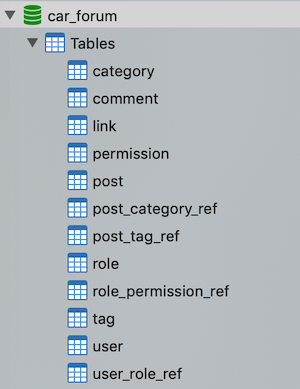
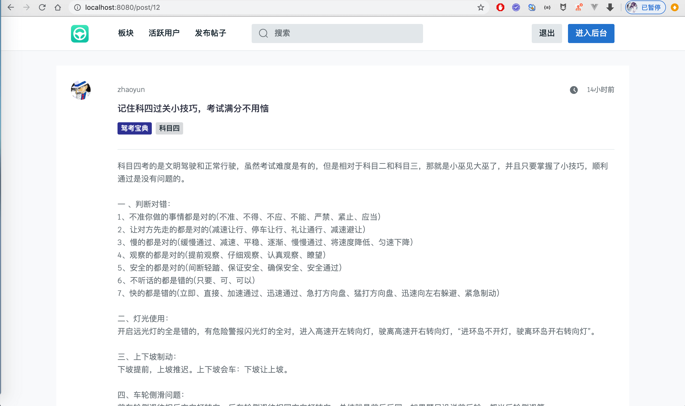
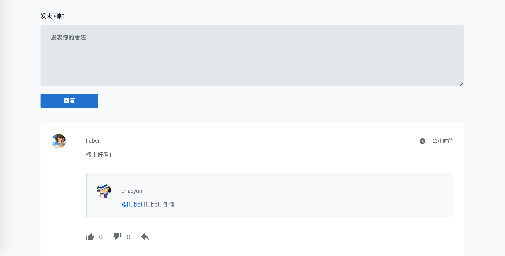
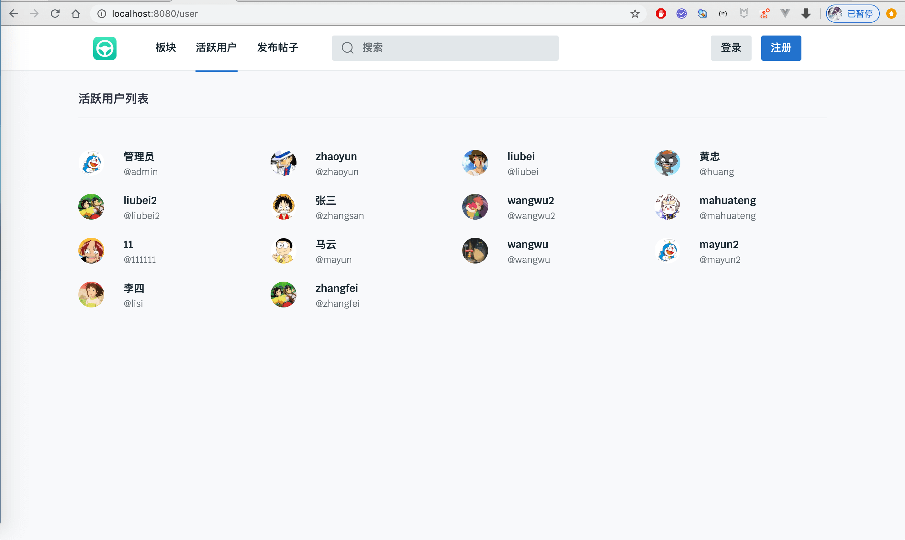
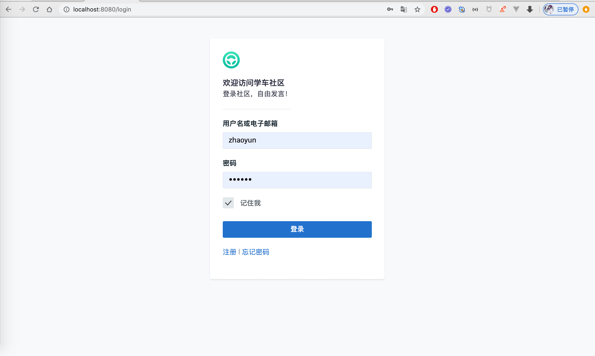
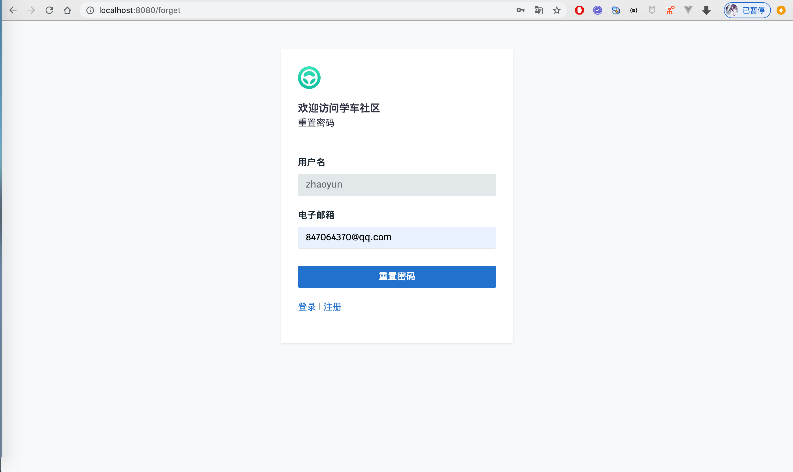
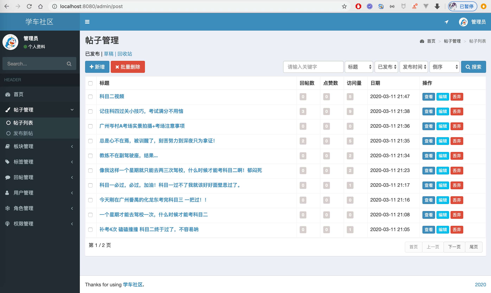
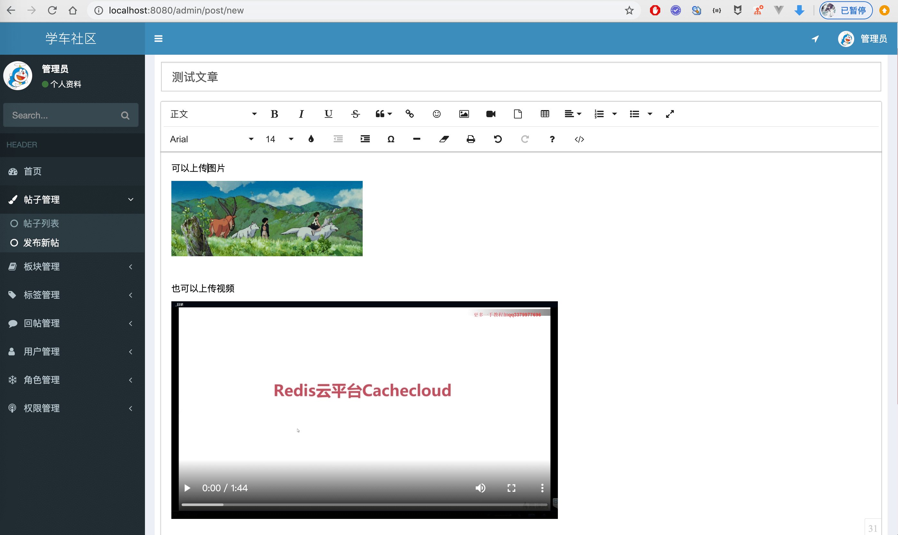
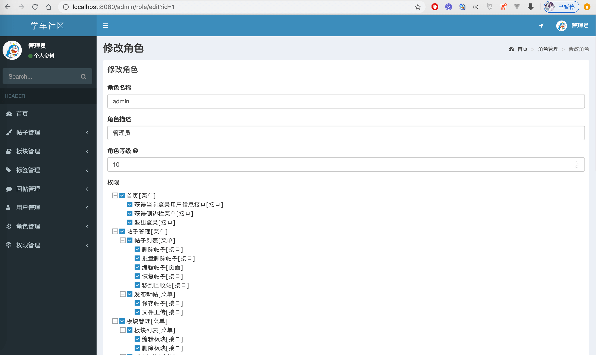

## 博主开发的其他论坛或博客项目全部在这里
**[https://liuyanzhao.com/shop.html?k=论坛](https://liuyanzhao.com/shop.html?k=论坛)** <br/>
**[https://liuyanzhao.com/shop.html?k=博客](https://liuyanzhao.com/shop.html?k=博客)**   <br/>
- -------------------------------------------------------------------------------
基于 SpringBoot + MyBatis + Thymeleaf 实现的博客/论坛系统。
<br/>
详细地址：[https://liuyanzhao.com/10206.html](https://liuyanzhao.com/10206.html)
同版论坛地址[https://github.com/saysky/forum](https://github.com/saysky/forum)


## 主要技术
1. SpringBoot2.x
2. MyBatis-Plus3.x
3. Thymeleaf
4. MySQL5.x (建议5.6+)或 MySQL8.x
5. Maven 3.5

## 本地启动教程
1. 使用 IDEA/Eclipse/MyEclipse 导入项目，推荐使用IDEA
2. 安装 Lombok 插件，因为项目中大量使用 `@Data` 和 `@Sl4j` 如果不安装将无法自动生成 `getter/setter` 方法 和 `log` 对象。
   - IDEA 安装Lombok方法是在 Plugins 里安装
   - Eclipse/MyEclipse 可以参考 `https://blog.csdn.net/yiyijianxian/article/details/80156910`
3. 创建数据库 `forum`, 导入 `forum.sql` 文件; 修改 application.yml 的数据库用户名和密码。
4. 以 Maven 方法导入项目，等依赖下载完毕，点击 Application.java 运行即可
5. 配置SMTP发送邮件
只有配置了SMTP，才能发送邮件，主要用于找回密码功能
1. 获取授权码 <br/>
    - 推荐使用QQ邮箱，打开QQ邮箱，点击【设置】-> 【账户】，往下翻，找到【POP3/IMAP/SMTP/Exchange/CardDAV/CalDAV服务】。
    开启【POP3/SMTP服务】，点击旁边的【启用】按钮。 点击【生成授权码】获取授权码，如 授权码如vtvhcjsacnuutest。
    

    - 修改配置文件 <br/>
    修改 `application.yml` 
    ```$xslt
    mail:
      smtp:
        host: smtp.qq.com
        username: 你的QQ邮箱如847064370@qq.com
        password: 授权码如vtvhcjsacnuutest
      from:
        name: 网站名称如言曌博客
    ```


## 项目结构和表结构
1. 项目结构
- 后端 springboot + mybatis
- 前端 thymeleaf + bootstrap + jQuery


2. 表结构
- 表名称按顺序分别如下：
- 分类表、评论表、友情链接表、权限表、文章表、文章和分类关联表、文章和标签关联表、角色表、角色和权限关联表、标签表、用户表、用户和角色关联表 <br/>


## 运行预览
备注：目前这个示例是学车论坛系统，只需要全局替换"贴子"->"文章"、"回帖"->"文章"。然后在后台修改文章标题和内容即可。

1. 首页


2. 详情页


3. 详情页2 
    - 可以发布文字、图片和视频
    - 有访问量、点赞和评论功能


4. 评论 
    - 可以评论和对评论回复
    - 可以对评论进行点赞和点踩


5. 分类列表
    - 所有的分类


6. 活跃用户列表
    - 活跃的用户


7. 登录
    - 支持记住密码


8. 注册
    - 会校验用户名和邮箱是否注册


9. 忘记密码
    - 如果用户名和邮箱匹配，会给该邮箱发送新的密码


10. 管理员后台
    - 管理员后台功能较多
    - 可以控制所有的文章和所有的评论
    - 可以管理分类、标签、用户、权限和角色等


11. 普通用户后台
    - 普通用户可以管理自己的文章
    - 可以看到自己发布的评论和收到的评论


12. 文章编辑页面
    - 富文本编辑器
    - 可以上传图片和视频


13. 角色授权页面
    - 修改角色信息
    - 树状绑定权限


其他的就不一一截图了

## 完整版
目前前端HTML文件没有开源，但是后端代码依然值得学习。需要完整版本的，联系本人：
微信 847064370

